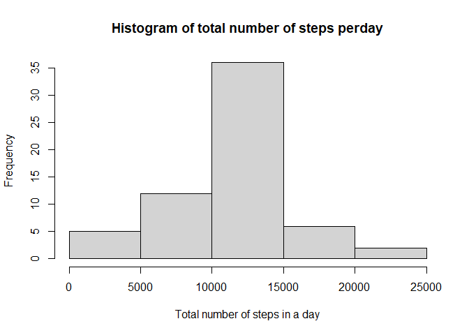

## Loading and preprocessing the data
1. Load the data (i.e. \color{red}{\verb|read.csv()|}read.csv())
2. Process/transform the data (if necessary) into a format suitable for your analysis


```r
library(knitr)

unzip("C:/Users/ssyy2/Downloads/R/RepData_PeerAssessment1/activity.zip", exdir="C:/Users/ssyy2/Downloads/R/RepData_PeerAssessment1")

data <- read.csv("C:/Users/ssyy2/Downloads/R/RepData_PeerAssessment1/activity.csv")
head (data)
```

```
##   steps       date interval
## 1    NA 2012-10-01        0
## 2    NA 2012-10-01        5
## 3    NA 2012-10-01       10
## 4    NA 2012-10-01       15
## 5    NA 2012-10-01       20
## 6    NA 2012-10-01       25
```

```r
data1 <- na.omit(data)
head(data1)
```

```
##     steps       date interval
## 289     0 2012-10-02        0
## 290     0 2012-10-02        5
## 291     0 2012-10-02       10
## 292     0 2012-10-02       15
## 293     0 2012-10-02       20
## 294     0 2012-10-02       25
```


## What is mean total number of steps taken per day?
1. Create histogram to see the total number of steps per day


```r
library (data.table)
```

```
## Warning: package 'data.table' was built under R version 4.0.4
```

```r
# create data table
data_table <- data.table(data1)
head(data_table)
```

```
##    steps       date interval
## 1:     0 2012-10-02        0
## 2:     0 2012-10-02        5
## 3:     0 2012-10-02       10
## 4:     0 2012-10-02       15
## 5:     0 2012-10-02       20
## 6:     0 2012-10-02       25
```

```r
# create data frame
data_frame <- as.data.frame(data_table[, list(total=sum(steps)), by=c("date")])
head(data_frame)
```

```
##         date total
## 1 2012-10-02   126
## 2 2012-10-03 11352
## 3 2012-10-04 12116
## 4 2012-10-05 13294
## 5 2012-10-06 15420
## 6 2012-10-07 11015
```

```r
# plot histogram
hist(data_frame$total, main="Total number of steps per day", xlab="Total number of steps per day")
```

<!-- -->

2. calculate mean


```r
mean1 <- mean(data_frame$total)
median1 <- median(data_frame$total)
```

The mean is 10766.19.The median is 10765.


## What is the average daily activity pattern?
1. Make a time series plot (i.e. \color{red}{\verb|type = "l"|}type = "l") of the 5-minute interval (x-axis) and the average number of steps taken, averaged across all days (y-axis)


```r
interval_steps <- aggregate(steps~interval, data1, mean)
head(interval_steps)
```

```
##   interval     steps
## 1        0 1.7169811
## 2        5 0.3396226
## 3       10 0.1320755
## 4       15 0.1509434
## 5       20 0.0754717
## 6       25 2.0943396
```

```r
plot(interval_steps$interval, interval_steps$steps, type="l", main="Average number of steps averaged across all days", xlab="Interval", ylab="Average number of steps")
```

<!-- -->

2. Which 5-minute interval, on average across all the days in the dataset, contains the maximum number of steps?


```r
max <- which.max(interval_steps$steps)
interval_steps[max,]
```

```
##     interval    steps
## 104      835 206.1698
```

The interval 835 has the maximum number of steps 206.17

## Imputing missing values
1. Calculate and report the total number of missing values in the dataset (i.e. the total number of rows with \color{red}{\verb|NA|}NAs)


```r
# find missing values for NA
sum(is.na(data))
```

```
## [1] 2304
```
There are 2304 missing values in the dataset

2. Devise a strategy for filling in all of the missing values in the dataset. The strategy does not need to be sophisticated. For example, you could use the mean/median for that day, or the mean for that 5-minute interval, etc.

I use the mean of 5-minute interval to fill in the vaules of th e missing values


3. Create a new dataset that is equal to the original dataset but with the missing data filled in.


```r
head(data)
```

```
##   steps       date interval
## 1    NA 2012-10-01        0
## 2    NA 2012-10-01        5
## 3    NA 2012-10-01       10
## 4    NA 2012-10-01       15
## 5    NA 2012-10-01       20
## 6    NA 2012-10-01       25
```

```r
data2 <- data

for(i in 1:nrow(data2)){
        if(is.na(data2$steps[i])){
                data2_interval <- data2$interval[i]
                data2_steps <- interval_steps[
                        interval_steps$interval==data2_interval,]
data2$steps[i] <- data2_steps$steps
        }
}
```


4. Make a histogram of the total number of steps taken each day and Calculate and report the mean and median total number of steps taken per day. Do these values differ from the estimates from the first part of the assignment? What is the impact of imputing missing data on the estimates of the total daily number of steps?


```r
Inserted <- aggregate(steps~date, data2, sum)

hist(Inserted$steps, main="Histogram of total number of steps perday", xlab="Total number of steps in a day")
```

<!-- -->

```r
mean2 <- mean(Inserted$steps)
median2 <- median(Inserted$steps)
```
Both mean and median is 10766.19, whereas previous data showed that mean and median is 10766.19 and 10765, respectively.


## Are there differences in activity patterns between weekdays and weekends?

For this part the weekdays() function may be of some help here. Use the dataset with the filled-in missing values for this part.

1. Create a new factor variable in the dataset with two levels – “weekday” and “weekend” indicating whether a given date is a weekday or weekend day.
 

```r
data2["type_of_day"] <- weekdays(as.Date(data2$date))
data2$type_of_day[data2$type_of_day %in% c("Saturday", "Sunday")] <- "weekend"
data2$type_of_day[data2$type_of_day !="weekend"] <- "weekday"

# convert type_of_day from character to factor
data2$type_of_day <- as.factor(data2$type_of_day)

# calculate average steps by interval across all days
steps_by_interval <- aggregate(steps~interval+type_of_day, data2, mean)

# create a plot
library(ggplot2)
```

```
## Warning: package 'ggplot2' was built under R version 4.0.4
```

```r
qplot(interval, steps, data=steps_by_interval,
      geom=c("line"), xlab="Interval", ylab="Number of steps")+facet_wrap(~type_of_day, ncol=1)
```

<!-- -->
